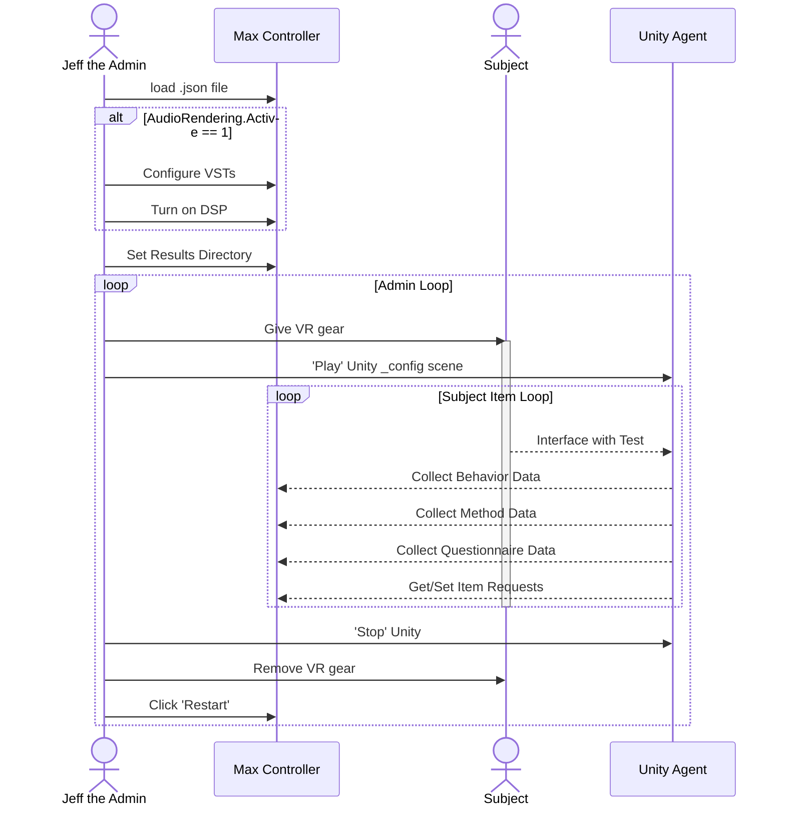

import CenteringImage from '../src/components/centeringImage';

# Example Test

## A Test Walkthrough

Let's go through a complete example test.

:::tip Before you start

Make sure you have installed the QExE tool on your machine following the [download](./downloading.mdx) information.

:::

### Max Controller

1. Open the MaxMSP Controller project.
    - From source project download: `./MaxController/src/patcher/main.maxpat`
    - From the build download: `./MaxController/QExE.exe`
2. Ensure you have no error messages on the console menu. If you any errors, take a look at the troubleshooting Section.

<CenteringImage 
    imageUrl={'../img/screenshots/MaxStep1.png'}
    alt={"alt text"}
    width={"100%"}
/>

3. Click 'Load File', and navigate to the `testfiles` directory, and open the InteractionDemoConfig.json.
    - You can check the console window again to see the import print out of the config file. 
    - If you have any error message here, it is likely that the files (VSTs) cannot be located.

<CenteringImage 
    imageUrl={'../img/screenshots/MaxStep1-1.png'}
    alt={"alt text"}
    width={"50%"}
/>
 

4. Set your Results Directory. 

<CenteringImage 
    imageUrl={'../img/screenshots/MaxStep2.png'}
    alt={"alt text"}
    width={"100%"}
/>
 

5. Under the "Current Item > Audio Information" you can configure any object-based or multi-channel audio rendering VSTs that you have loaded. 
6. Turn on DSP. 
    - Once you click the loudspeaker symbol, you will see the DSP utilization start to flicker around 1-3%
    - You can alter your buffer size and I/O drivers by clicking on the ***\<settings\>*** text.

<CenteringImage 
    imageUrl={'../img/screenshots/MaxStep3.png'}
    alt={"alt text"}
    width={"100%"}
/>

### Unity Agent 

1. Open the Unity project via your Unity hub.
2. Open the `_config` scene and press the Unity "Play" icon. 

<CenteringImage 
    imageUrl={'../img/screenshots/UnityStep1.png'}
    alt={"alt text"}
    width={"100%"}
/>
 

3. Test has started. 
    - The Max Controller and Unity Agent will begin to communicate and the remainder of the test will be controlled through the subject in VR. 
    - You can view the communication either in the Max or Unity console window. In the example below, you can see that Unity has imported the correct method to the scene, and found the mandatory UI elements for communication. 

<CenteringImage 
    imageUrl={'../img/screenshots/UnityStep2.png'}
    alt={"alt text"}
    width={"100%"}
/>

---

## Sequence Diagram

The following diagram shows the initial setup for a test, followed by the two loops:
-  The Admin loop, is repeated per subject. 
- The Subject loop, is each subject performing their assigned task for each evalution item.

