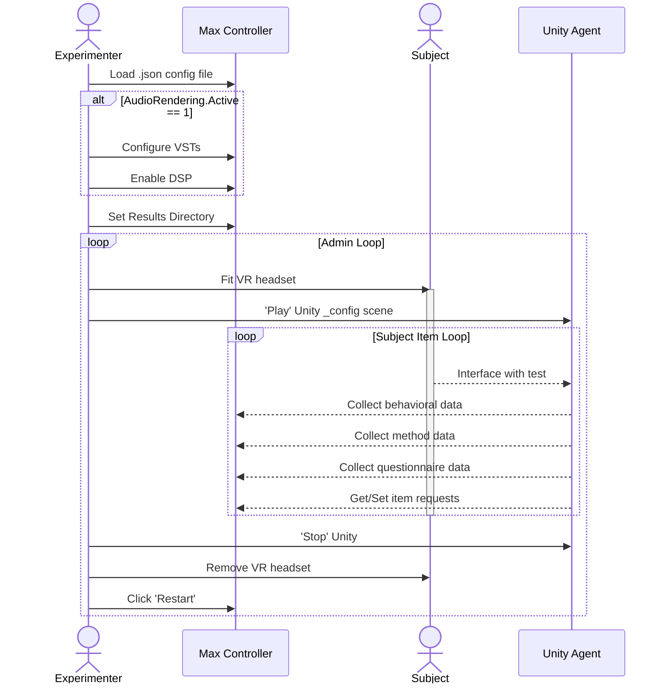

import DocFigure from '../src/components/DocFigure';
import CaptionedImage from '../src/components/CaptionedImage.jsx';

import MaxStep1 from '../static/img/screenshots/MaxStep1.png'
import MaxStep3 from '../static/img/screenshots/MaxStep1-1.png'
import MaxStep4 from '../static/img/screenshots/MaxStep2.png'
import MaxStep6 from '../static/img/screenshots/MaxStep3.png'

import UnityStep1 from '../static/img/screenshots/UnityStep1.png'
import UnityStep2 from '../static/img/screenshots/UnityStep2.png'

# Example Test

The following steps cover a complete test run using the `_interactionDemo` scene included with the QExE Unity Agent project.

:::warning Before you start

Ensure QExE has been installed by following the [download and setup](./downloading) instructions.

:::

## Max Controller

1. Open the MaxMSP Controller project.
    - From the source download: `./qexe_controller/src/patchers/main.maxpat`
    - From the build download: `./qexe_controller/QExE.exe`

2. Check the console for any error messages on startup. If you see any errors, refer to the troubleshooting section.

<CaptionedImage
  alt="Step 1 of max setup. "
  source={MaxStep1}
  header="Step 2 Reference. "
  description="Opening the MaxMSP Controller project and check if you have any console error. If you have added your working git directory to Max setting path sources, you should not see any errors."
  padding="5% 2% 5% 2%"
/>

3. Click 'Load File', and navigate to the `testfiles` directory, and open the InteractionDemoConfig.json.
    - You can check the console window again to see the import print out of the config file. 
    - If you have any error message here, it is likely that the files (VSTs) cannot be located.

<CaptionedImage
  alt="Step 3 of max setup. "
  source={MaxStep3}
  header="Step 3 Reference. "
  description="After loading the .json file, the console window should give you confirmation of the different settings without errors."
  padding="5% 10% 5% 10%"
/>

4. Set your Results Directory. 

<CaptionedImage
  alt="Step 4 of max setup. "
  source={MaxStep4}
  header="Step 4 Reference. "
  description="Set the directory where the results files will be saved."
  padding="5% 5% 5% 5%"
/>

5. Under the "Current Item > Audio Information" you can configure any object-based or multi-channel audio rendering VSTs that you have loaded. 
6. Turn on DSP. 
    - Once you click the loudspeaker symbol, you will see the DSP utilization start to flicker around 1-3%
    - You can alter your buffer size and I/O drivers by clicking on the ***\<settings\>*** text.

<CaptionedImage
  alt="Step 6 of max setup. "
  source={MaxStep6}
  header="Step 6 Reference. "
  description="If you are using audio rendering, and have loaded .wav files and VSTs, make sure to turn on audio signal processing."
  padding="5% 5% 5% 5%"
/>

### Unity Agent 

1. Open the Unity project via your Unity hub.
2. Open the `_config` scene and press the Unity "Play" icon. 

<CaptionedImage
  alt="Step 2 of Unity setup. "
  source={UnityStep1}
  header="Step 2 Reference. "
  description="Opening the Unity project should reveal this view. If not, make sure to open the _config scene."
  padding="5% 5% 5% 5%"
/>

3. Test has started. 
    - The Max Controller and Unity Agent will begin to communicate and the remainder of the test will be controlled through the subject in VR. 
    - You can view the communication either in the Max or Unity console window. In the example below, you can see that Unity has imported the correct method to the scene, and found the mandatory UI elements for communication. 

<CaptionedImage
  alt="Step 3 of Unity setup. "
  source={UnityStep2}
  header="Step 3 Reference. "
  description="When clicking 'Play', in at the top of the Unity project, the test should automatically configure, and be ready to go after a few seconds. You can monitor the OSC communication either via the Unity or MaxMSP consoles."
  padding="5% 5% 5% 5%"
/>

---

## Sequence Diagram

The diagram below shows the test administration sequence from initial setup through to completion. Two loops are shown:

- **Admin Loop** — repeated once per participant
- **Subject Item Loop** — each participant progressing through their assigned evaluation items

