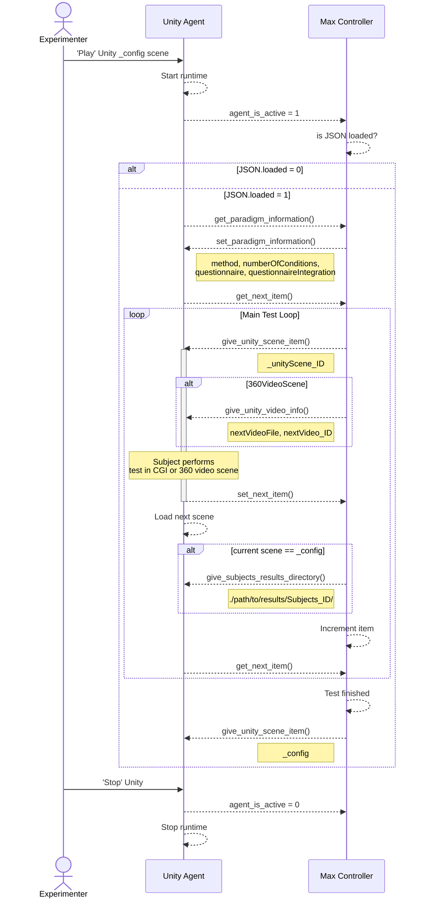

# OSC Communication

## Sequence Diagram

The sequence diagram below illustrates the OSC message flow used to automate a test session.

## OSC Message List

:::warning

Arguments in speech marks " " indicate constants. These string values are used to trigger specific functions in the receiving program.

:::

### Max → Unity

|Address |  Arguments | Type | Description |
| --- | - | - | - |
| /client/item/ | "set_scene_item",   unityScene_ID | String,   String | Variable for OSC message switch in Unity,   Name of Unity scene for method | 
| /client/item/ | "set_video_item",   videoFile,   videoID  | String,   String,   Int| Variable for OSC message switch case in Unity,   URL to video file,   ID number of video file | 
| /client/results/ | subjectsPath | String | URL to this subjects result directory | 
| /client/configuration/ | "set_paradigm_information",   method,   numberOfConditions,   questionnaire,   questionnaireIntegration | String,   String,   Int,   String,   String | Variable for OSC message switch in Unity,   Name of the method,   Number of parallel conditions,   Name of questionnaire,   How the questionnaire should be integrated | 
| /client/configuration/ | "json_loaded",   jsonLoaded | String,   Int | Variable for OSC message switch in Unity,   Value to tell Unity is a JSON file is loaded in Max | 

### Unity → Max

|Address |  Arguments | Type | Description |
| --- | - | - | - |
| /control/ | "get_next_item" | String | Calls function to ask the TestManager for the next unityScene_ID | 
| /control/ | "set_next_item" | String | Calls function to load and set the next item |
| /control/ | "client_is_active",   clientState| String,   Int | Calls prompt to indicate client status,   Tells Max that Unity is running or stopped | 
| /control/ | "get_paradigm_information" | String | Calls function to send back the paradigm variables | 
| /stream/objectspose/ | objectIndex,   objectPosition | Int,   Vector3 | Index to identify which audio source should be updated,   [X, Y, Z] position in Unity coordinates | 
| /stream/objectstrigger/ | objectIndex,   triggerMessage | Int,   String | Index to identify which audio source should be updated,   "Play" or "Stop" message to control event audio playback |
| /stream/userpose/pos/ | userPositionPos | Vector3 | [X, Y, Z] position in Unity coordinates | 
| /stream/userpose/rot/ | userPositionRot | Vector3 | [X, Y, Z] (Yaw, Pitch, Roll) rotation in Euler angles | 
| /stream/userpose/teleport | userTeleportFlag | Int | Transition from 0 to 1 indicate successful teleportation | 
| /stream/controllerpose/left/ | controllerPos,   controllerRot | Vector3,   Vector3 | [X, Y, Z] position in Unity coordinates,   [X, Y, Z] (Yaw, Pitch, Roll) rotation in Euler angles | 
| /stream/controllerpose/right/ | controllerPos,   controllerRot | Vector3,   Vector3 | [X, Y, Z] position in Unity coordinates,   [X, Y, Z] (Yaw, Pitch, Roll) rotation in Euler angles | 
| /audioplayback/ | audioPlayback | String | "Play" or "Stop" message to control continuous audio playback | 

